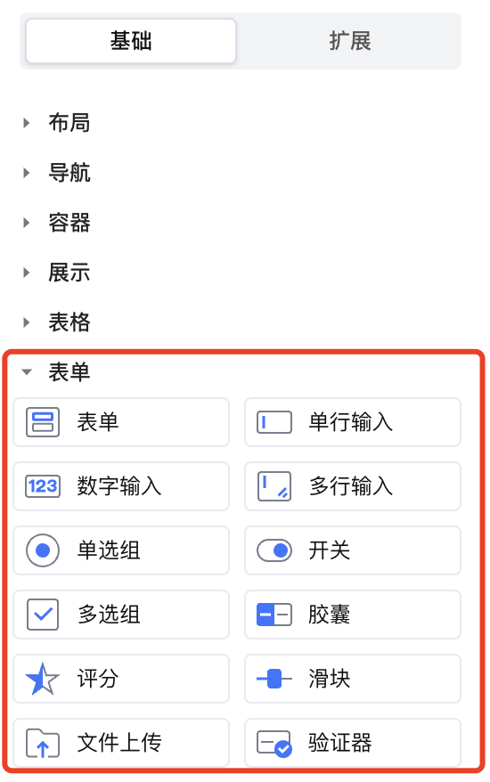
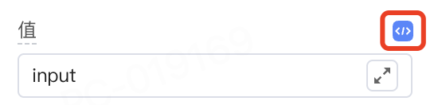
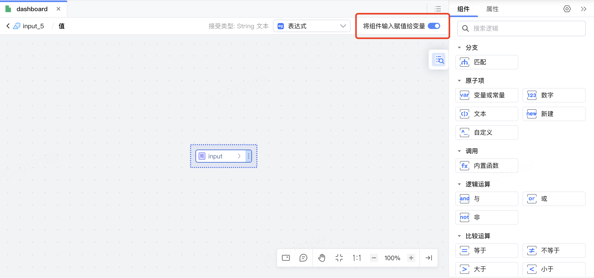

<script setup>
import { VTCodeGroup, VTCodeGroupTab } from '../../../.vitepress/components'
</script>

# 表单组件的能力适配

在设计表单类组件时，需确保组件具备作为表单项的能力，主要包括以下两个方面：

- [组件的值能够实现双向绑定](#值双向绑定处理​)；
- [组件的值可以进行校验](#组件支持表单校验)。



## 值双向绑定处理
### 1. 功能说明

平台需要组件支持值同步到绑定变量的能力，用于传递表单项中输入、选择的值。


以单行输入组件为例，功能效果参考如下：

1.  在IDE中，单行输入的“值”属性对应输入框中的内容，该数据支持编辑表达式。

    

1.  编辑表达式时，若绑定变量，支持开启“将组件输入赋值给变量”。开启“将组件输入赋值给变量”后即表示支持值同步到绑定变量。

    

1.  发布应用后，在制品中向输入框中输入内容，该输入内容即同步存储到绑定变量中。

### 2. 功能实现

1.  目前 Vue2 通过.sync修饰符来支持绑定同步，社区组件很多只适配了 v-model，需要组件内部对外抛出 \$emit('update\:value')事件。

    ```typescript
    <template>
    <el-input v-bind="$attrs" :value="value" @input="handleInput" />
    </template>
    <script>
    export default {
      props: {
        value: String,
      },
      methods: {
        handleInput(val) {
          this.$emit('update:value', val);
          this.$emit('input', val);
        },
      }
    }
    </script>
    ```

    <div class="highlight">

    React 会自动监听onChange事件来更新绑定变量。

    </div>
    

1.  在 api.ts 文件中为相关属性设置sync: true即为允许同步。

    ```typescript
    @Prop({
    group: '数据属性',
    title: '值',
    sync: true, // 开启值同步
    })
    value: V;
    ```

## 组件支持表单校验

### Vue2 框架下表单验证支持

默认 `Vue2` 组件 `option` 中设置了 `model` 既可以支持表单验证， 例如：

```vue
<template>
  <input :value="value" @input="handleInput" />
</template>
<script>
export default {
  model: {
    prop: 'value',
    event: 'update:value',
  },
  props: {
    value: String,
  },
  methods: {
    handleInput(val) {
      this.$emit('update:value', val);
      this.$emit('input', val);
    },
  }
}
</script>
```

### Vue3 / React 框架下表单验证支持

Vue3 / React 框架下组件能默认支持表单验证，无需修改代码；


### Vue2 CloudUI 下的表单验证支持

(CloudUI)表单类组件支持验证

需要同步值给负责验证的组件，步骤如下


#### 创建mixins 相关文件


```js
// mixins/field.js
const broadcast = function (condition, eventName, ...args) {
  this.$children.forEach(($child) => {
    if (condition($child)) $child.$emit(eventName, ...args);
    else broadcast.apply($child, [condition, eventName].concat(args));
  });
};


export default {
  name: 'm-emitter',
  methods: {
    $dispatch(condition, eventName, ...args) {
      if (typeof condition === 'string') {
        const name = condition;
        condition = ($parent) => $parent.$options.name === name;
      }
      let $parent = this.$parent || this.$root;
      while ($parent && !condition($parent)) $parent = $parent.$parent;
      $parent && $parent.$emit(eventName, ...args);
    },
    $broadcast(condition, eventName, ...args) {
      if (typeof condition === 'string') {
        const name = condition;
        condition = ($child) => $child.$options.name === name;
      }
      broadcast.apply(this, [condition, eventName].concat(args));
    },
    $contact(condition, callback) {
      if (typeof condition === 'string') {
        const name = condition;
        condition = ($parent) => $parent.$options.name === name;
      }
      let $parent = this.$parent || this.$root;
      while ($parent && !condition($parent)) $parent = $parent.$parent;
      return $parent && callback($parent);
    },
    $emitPrevent(name, $event, senderVM, ...args) {
      let cancel = false;
      this.$emit(
        name,
        Object.assign($event || {}, {
          preventDefault: () => (cancel = true),
        }),
        senderVM,
        ...args,
      );
      return cancel;
    },
  },
};
```


```js
// mixins/field.js
/* eslint-disable no-unused-expressions */
import MEmitter from './emitter';


export default {
  name: 'm-field',
  isField: true,
  mixins: [MEmitter],
  data() {
    return {
      validatorVM: undefined,
      formItemVM: undefined, // @compat
    };
  },
  created() {
    this.$dispatch(
      ($parent) => ($parent.$options.name && $parent.$options.name.endsWith('u-form-item'))
          || $parent.$options.isField || $parent.$options.isValidator,
      'add-field-vm',
      this,
    );
    this.$on('update', (value) => {
      const validatorVM = this.validatorVM || this.formItemVM; // @compat
      validatorVM && validatorVM.$emit('update', value);
    });
    this.$on('input', (value) => {
      const validatorVM = this.validatorVM || this.formItemVM; // @compat
      validatorVM && validatorVM.$emit('input', value);
    });
    this.$on('change', ($event) => {
      const validatorVM = this.validatorVM || this.formItemVM; // @compat
      validatorVM && validatorVM.$emit('change', $event);
    });
    this.$on('focus', () => {
      const validatorVM = this.validatorVM || this.formItemVM; // @compat
      validatorVM && validatorVM.$emit('focus');
    });
    this.$on('blur', () => {
      const validatorVM = this.validatorVM || this.formItemVM; // @compat
      validatorVM && validatorVM.$emit('blur');
    });
  },
  destroyed() {
    const validatorVM = this.validatorVM || this.formItemVM; // @compat
    validatorVM && validatorVM.$emit('remove-field-vm', this);
  },
};
```


#### 引入mixins


```vue
// index.vue
<template>
  <div>
    <input :value="value" @change="handleChange" @input="handleInput" @focus="handleFocus" @blur="handleBlur"` />
  </div>
</template>
<script>
import MField from './mixins/field';


export default {
  name: 'index',
  mixins: [MField],
  data() {
    return {
      value: '',
    };
  },
  methods: {
    handleChange(value) {
      this.value = value;
      this.$emit('change', { value });
    },
    handleInput(value) {
      this.value = value;
      this.$emit('update:value', value);
      this.$emit('input', value);
    },
    handleFocus() {
      this.$emit('focus');
    },
    handleBlur() {
      this.$emit('blur');
    },
  },
};
</script>
```
